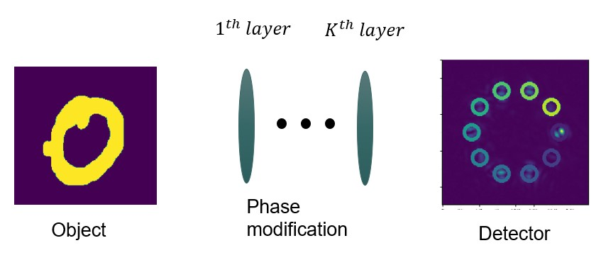
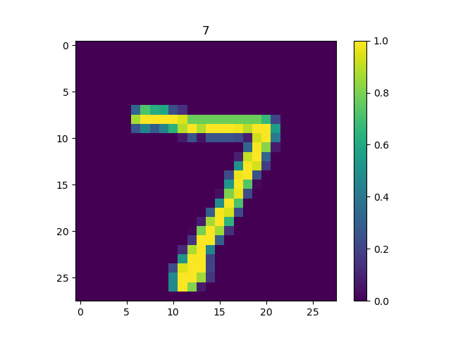
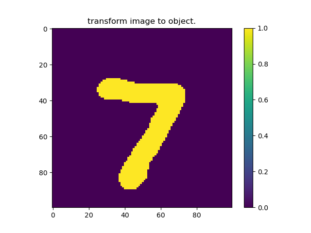
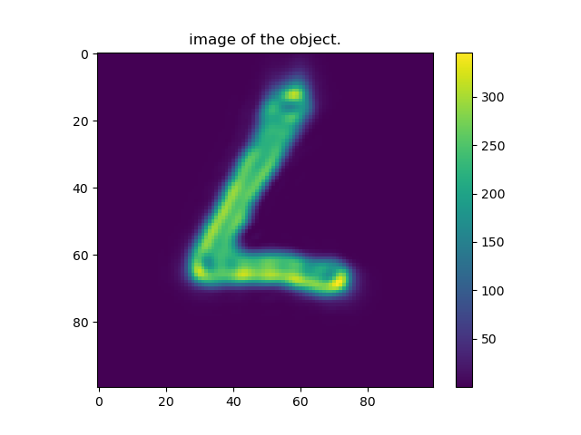
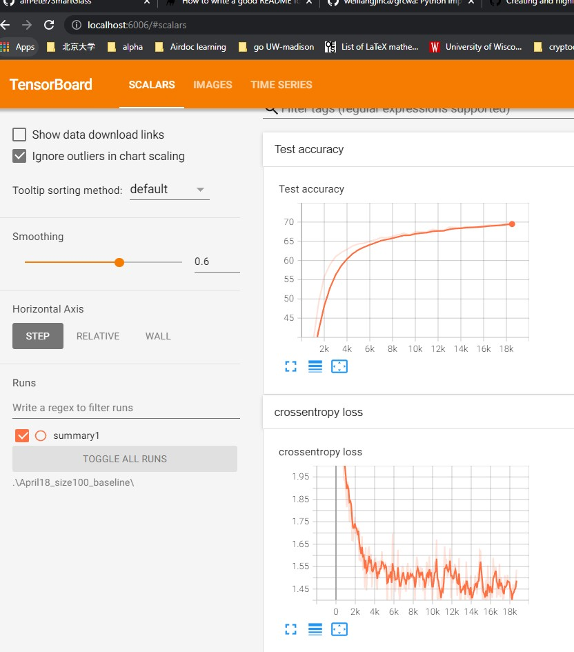

# SmartGlass
## Introduction
SmartGlass (SG) is a python implementation of a diffractive optical neural network. Currently, it supports training an all-optical classifier (e.g. classify hand-written digits MNIST dataset). Besides, the framework can also be used to design optics based on a task like focusing and beam steering. However, custom object functions should be defined. \
Besides training the optics, the SG also supports training the detectors using gradient-free optimization. (e.g moving the position of the detector so that the accuracy is maximized)
## note
The function supported by SmartGlass is very limited. But it provides a good starting point. So, if you want to do more with it. Do spend some time reading the code and feel free to modify the code when you know how it works. The current code only supports phase modification. But you can easily add Amplitude modification if you look at the code.

## Install
no installation is required. Just copy the SmartGlass directory to where you want to use the package. Although you don't need to install SmartGlass, you do need to install several common machine learning software which the SmartGlass are rely on.

## dependence
* python3
* Pytorch >= 1.9
* numpy
* tqdm
* pandas
* cv2
* seaborn
* sklearn
* gradient_free_optimizers (optional, only if you want to train the detectors, https://github.com/SimonBlanke/Gradient-Free-Optimizers)

## Getting start
The SmartGlass (SG), currently only supports a coherent light model, and plan to add an incoherent model in the future. 

The general idea is very simple. For each image in your dataset, the value of each pixel is treated as a light source (you can increase the resolution of your image by cv2.resize). Then the light propagates in free space, passes through the optical layer, free space again, and finally reaches the detector. As shown in the figure.

**To begin the forward simulation**:
```
import SmartGlass as SG
```
```
#import sys
#module_path = 'the path of SmartGlass directory'
#sys.path.insert(1, module_path) #this is needed if you don't want to copy the SmartGlass directory at the same level as the running script.
import numpy as np
import matplotlib.pyplot as plt
import torchvision
```
create the MNIST obj:
```
obj = SG.MNISTObj(font = 9, size = 40)
#for the MNIST dataset, the image size is 28, the obj will resize the image to 40, and convert the grayscale to binary based on the font. The font means how thick you want the drawing line to be.
The process is first Gaussian blur the image, then binarilize the values by a threshold. The larger the std of your gaussian blur kernel, the thicker the written digits.
```
create detector:
For the gradient-free optimizer, the basic idea is very simple. Assume you have a block box function named "object function". the input it takes is the parameters you want to optimize (e.g. the position of the detector). The output is the performance of your model given the parameters. (e.g. the accuracy of the classifier). The optimizer will decide how to update the parameters without knowing the details of your objective function. A simple example is the optimizer can randomly initialize the parameters for each step. And after 1000 steps, return the parameters with the highest accuracy. There are many optimizers you can choose, for details please refer to the "gradient_free_optimizers" documents.
```
num_classes = 10
C = 25
R = 15
coos = []
for i in range(num_classes):
    theta = i * 2 * np.pi / num_classes
    x = C + R * np.cos(theta)
    y = C + R * np.sin(theta)
    coos.append([y, x])
# the coos is a list of length 10, each element is the coordinate of one detector.
coos = np.array(coos)
detector = SG.CirleDetector(radius= 5, coos = coos)
# here, we create 10 cirlar detectors arranged in circle.
```
create simulation object:
```
sim = SG.Coherent(
    wavelength = 1, #you can view the unit is um, however, the code is actually unitless.
    num_layers= 1,
    size = 50, #the size of planes. size of image plane = optical plane = detector plane.
    res = 2, #if res = 2, then the optics is represented by 100 * 100 points, since the size = 50.
    prop_dis = 100, #the distance between planes. we assume the distance between each plane is same.
    object = obj,
    num_classes= num_classes,
)
```
Initialize the PyTorch model:
```
init_phase = SG.lens_profile(sim.plane_size, sim.step_size, sim.prop_dis/2, sim.wavelength)
# here we provide a ideal lens profile so that you can debug your forward process. 
#if the init_phase = None, then the phase (optical layer) is initialized as 0.
sim.init_model('cuda', init_phase, detector)
```
provide an image:
```
mnist = torchvision.datasets.MNIST('dataset/', train= False, download = True)
x, y = mnist[0]
x = np.array(x)/255
SG.vis_img(img = x, title = str(y))
```

create a obj:
```
obj = sim.gen_obj(x)
SG.vis_img(np.squeeze(obj), "transform image to object.")
```

run the forward process:
```
img = sim.forward(obj)
SG.vis_img(np.squeeze(img), "image of the object.")
```

This is the end the forward example, the debug_forward.py is provided in "debug_SmartGlass" directory.

**The optimization**:
optimize the optics:
'''
sim.init_model('cuda', init_phase = None, init_detector = detector)
batch_size = 64
data_path = 'dataset/MNIST/'
sim.optimze_optics(
    lr = 0.001, 
    beta = 0.001,
    batch_size = batch_size,
    epoches = 20,
    test_freq = 500,
    notes = 'April18_size100_baseline',
    mu_white_noise= 10, # >0
    data_path = data_path)
'''
the sim.optimze_optics will create an output_coherent directory if it does not exists. You will see "notes" as a directory name in the "output_coherent". In the "notes", you will see a "summary" directory, which can be read by tensorboard. 
```
tensorboard --logdir "the path of the summary"
```
After running the tensorboard, you will see something like this in your browser:\\


notes: you can add anything you want to the "summary", using the torch.summarywirter, as written in the SG.

**optimize the detectors**

```
sim.init_model('cuda', init_phase = phase, init_detector = detector)
batch_size = 64
data_path = 'dataset/MNIST/'
test_samples = 10000
select_idx = np.random.choice(np.arange(test_samples), size = (500,)) #we only select 500 images to evaluate the accuracy of current model, because 10000 is too much, which makes the evaluation very slow.
opt_res = sim.optimze_detector(batch_size, data_path, select_idx, n_iter = 100)
```
All the codes are in "debug_SmartGlass" directory. 
## Citing


